```{r setup, include=FALSE}
knitr::opts_chunk$set(echo = TRUE)
```
```{r}
library(mlbench)
library(tidyr)
library(dplyr)
library(ggplot2)
library(forecast)
library(fma)
library(fpp2)
library(gridExtra)
library(urca)
library(tseries)


```

##### <span style="color:blue"><b><u>HA# 2.3</u></b></span>
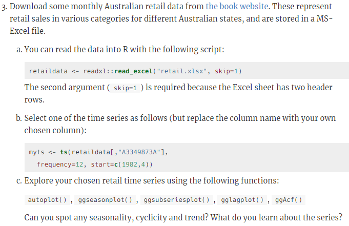
#### a) You can read the data into R with the following script:

```{r,echo = TRUE}
retaildata <- readxl::read_excel("retail.xlsx", skip=1)
```

The second argument (skip=1) is required because the Excel sheet has two header rows.

### b) Select one of the time series as follows (but replace the column name with your own chosen column):

```{r,echo = TRUE}
myts <- ts(retaildata[,"A3349873A"],frequency=12, start=c(1982,4))
head(myts)
```

### c) Explore your chosen retail time series using the following functions:

autoplot(), ggseasonplot(), ggsubseriesplot(), gglagplot(), ggAcf()

Can you spot any seasonality, cyclicity and trend? What do you learn about the series?

```{r,echo = TRUE}
autoplot(myts) +
  ggtitle("Monthly retail data: Australia") +
  xlab("Year") +
  ylab("Thousands")
```
                                  
                                   
Time series plot reveals following features:

1) There is continuous increment for business in retail sector data from 1982 to2012.

2) Sudden dip was observed in year 2000 and  2010 may be due to resession and slowdown of market.

3) Retail market shows dips for start of year and gradual highs towards end of it.

```{r,echo = TRUE}
ggseasonplot(myts, year.labels=TRUE, year.labels.left=TRUE) +
  ylab("$ million") +
  ggtitle("Seasonal plot: Retail data")
```
                                  
A seasonal plot allows the underlaying pattern to be seen more clearly and are useful in identifying years in which the pattern changes.
In our case, above plot makes it clear that there is large jump in retail sector by end of year , mostly in Nov and Dec.patterns also make us notice that there are 
unsual dips in retail sector around Jun ,July.Seasonal plot is similar to time plot except the data are plotted against the individual "seasons" in which data were observed.There can also be variation made in plot using polar co-ordinates.

```{r,echo = TRUE}
ggseasonplot(myts, polar = TRUE) +
  ylab("$ million") +
  ggtitle("Seasonal plot: Retail data")
```
        
                             

```{r,echo = TRUE}
ggsubseriesplot(myts) +
  ylab("$ million") +
  ggtitle("Seasonal subseries plot: antidiabetic drug sales")
```
                                   
                                      
Seasonality plot validates our clain that retail sector has maximum business in November and December each year.
The horizontal line indicates means for each month.This form of plot enables the underlaying seasonal pattern to be seen clearly,also showing changes in seasonality over time.

```{r,echo = TRUE}
gglagplot(myts)
```
                              
Figure shows Lagged scatterplots for monthly retail data.
The relations are strongly positive for month 5,6,7 i.e May,June,July for lag 1,2,3,4 and strongly negative for month 5 in lag 5,6,7.

```{r,echo = TRUE}

ggAcf(window(myts),start = 1982)
```
                            
                                 
Figure 6 shows Autocorrelation function for monthly retail data for Australia.
As we can observe there is no negative co-relation observed. The dashed blue lines indicate whether the correlations are significantly different from zero.

##### <span style="color:blue"><b><u>HA# 2.7</u></b></span>


```{r,echo = TRUE}
myts1 <- ts(arrivals[,"Japan"])
a <- autoplot(myts1) + ggtitle("Arrivals to Australia from Japan") + ylab("Thousands")
myts2 <- ts(arrivals[,"NZ"])
b <- autoplot(myts2) + ggtitle("Arrivals to Australia from NZ") + ylab("Thousands")
myts3 <- ts(arrivals[,"UK"])
c <- autoplot(myts3) + ggtitle("Arrivals to Australia from UK") + ylab("Thousands")
myts4 <- ts(arrivals[,"US"])
d <- autoplot(myts4) + ggtitle("Arrivals to Australia from US") + ylab("Thousands")
grid.arrange(a,b,c,d, nrow = 2)
```
                                
                                 
```{r,echo = TRUE}
a1 <- ggseasonplot(arrivals[,"Japan"]) + ylab("Thousand") +ggtitle("Seasonal plot:Arrivals data for Japan")
b1 <- ggseasonplot(arrivals[,"NZ"]) + ylab("Thousand") +ggtitle("Seasonal plot:Arrivals data for NZ")
c1 <- ggseasonplot(arrivals[,"UK"]) + ylab("Thousand") +ggtitle("Seasonal plot:Arrivals data for UK")
d1 <- ggseasonplot(arrivals[,"US"]) + ylab("Thousand") +ggtitle("Seasonal plot:Arrivals data for US")
grid.arrange(a1,b1,c1,d1, nrow = 2)
```

                               
The most unusual observation is obsereved for arrival data in 'UK' for Q2 and Q3.The arrival numbers are drastically down but gradually increased in Q4.At the same time,
New zealand shows highest arrival rates for Q3.

```{r,echo = TRUE}
a2 <- ggsubseriesplot(arrivals[,"Japan"]) + ylab("Thousand") +ggtitle("Seasonal plot:Arrivals data for Japan")
b2 <- ggsubseriesplot(arrivals[,"NZ"]) + ylab("Thousand") +ggtitle("Seasonal plot:Arrivals data for NZ")
c2 <- ggsubseriesplot(arrivals[,"UK"]) + ylab("Thousand") +ggtitle("Seasonal plot:Arrivals data for UK")
d2 <- ggsubseriesplot(arrivals[,"US"]) + ylab("Thousand") +ggtitle("Seasonal plot:Arrivals data for US")
grid.arrange(a2,b2,c2,d2, nrow = 2) 
```
                                    
                                    

Seasonal subseries plot emphasises theseasonal patterns of data.The horizontal lines indicate means for each quarter.This form of plot enables the underlaying seasonal pattern to be seen clearly ,and also shows the changes in seasonality over time.If we observe seasonal plots for all four countries,New zealand has the highest rate of arrival data for all four quarters.UK seems to have lowest arrival rates for Q2 and Q3.

##### <span style="color:blue"><b><u>HA# 2.10</u></b></span>
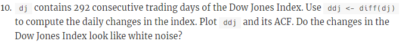
```{r}
ddj <- diff(dj)
autoplot(ddj)
ggAcf(ddj)
```

For white noise series, each autocorelation is expected to be close to zero.If one or more large spikes are outside these bounds of blue dotted lines, or if more than 5% of spikes are outside this bounds,then series is not a white noise. In our case,all the autocorelations lie within these limits,confirming that the data is white noise.


##### <span style="color:blue"><b><u>HA# 3.1</u></b></span>

```{r}
```

##### <span style="color:blue"><b><u>HA# 3.8</u></b></span>
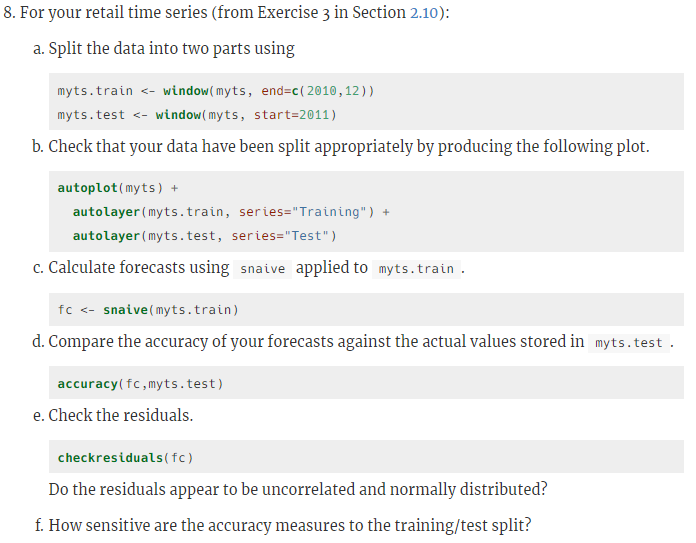

##### For your retail time series (from Exercise 3 in Section 2.10):

Loading the reatil data
```{r}
retaildata <- readxl::read_excel("retail.xlsx", skip=1)
myts <- ts(retaildata[,"A3349873A"],
  frequency=12, start=c(1982,4))
```
##### a) Split the data into two parts using

```{r }
myts.train <- window(myts, end=c(2010,12))
myts.test <- window(myts, start=2011)
```

##### b) Check that your data have been split appropriately by producing the following plot.

```{r}

autoplot(myts) + autolayer(myts.train, series="Training") +
  autolayer(myts.test, series="Test")
```

##### c) Calculate forecasts using snaive applied to myts.train.

```{r }
fc <- snaive(myts.train)
```

##### d) Compare the accuracy of your forecasts against the actual values stored in myts.test.

```{r }
accuracy(fc,myts.test)
```

##### e) Check the residuals.Do the residuals appear to be uncorrelated and normally distributed?

```{r }
checkresiduals(fc)
```

From the above it seems like residuals are correlated to each other.
Residuals are not normally distributed.

##### f) How sensitive are the accuracy measures to the training/test split?

```{r }
myts2.train <- window(myts, end=c(2011,12))
myts2.test <- window(myts, start=2012)
fc2 <- snaive(myts2.train)
accuracy(fc2,myts.test)
```
The accuracy measures are sensitive to the training/test split. Here we changed the train/test split percentage and run the accuracy check again and that reslts in low values in accuracy measure indicators. Comparing this to original matrix clearly indicates that the measures are sensitive to the split.

##### <span style="color:blue"><b><u>HA# 6.2</u></b></span>
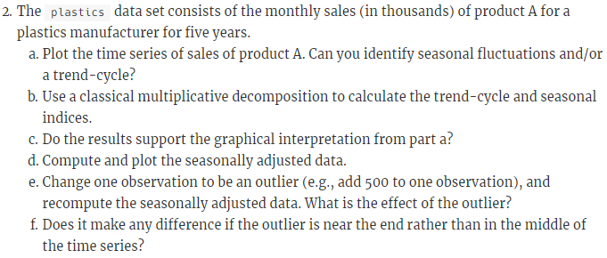
##### a) Plot the time series of sales of product A. Can you identify seasonal fluctuations and/or a trend-cycle?

Loading the required libraries and plastics data
```{r }

plastics
ts(plastics)
plot(plastics,main = 'Plastic time plot')
```

From the above Time plot we can see there are seasonal fluctuations and upward trend.
Seasonal sales are peaking in summer.
Overall plot shows positive trnd with sales increasing yearly.


##### b) Use a classical multiplicative decomposition to calculate the trend-cycle and seasonal indices.

```{r }
plastic_model <- decompose(plastics, type="multiplicative")
trend <- plastic_model$trend #calculating trend
trend
seasonal <- plastic_model$seasonal # calculating seasonal indices
seasonal

```


##### c) Do the results support the graphical interpretation from part a?

Yes, the results support the graphical interpretation.The graph indicates that the summer months have higher  seasonal indices than the winter months


##### d) Compute and plot the seasonally adjusted data.

Here we are  showing the trend-cycle component and the seasonally adjusted data, along with the original data.

```{r }
autoplot(plastics, series="Data") +
  autolayer(trendcycle(plastic_model), series="Trend") +
  autolayer(seasadj(plastic_model), series="Seasonally Adjusted") +
  xlab("Year") + ylab("Monthly Sales in Thousands") +
  ggtitle("Plastic Sales") +
  scale_colour_manual(values=c("gray","blue","red"), breaks=c("Data","Seasonally Adjusted","Trend"))
```

##### e) Change one observation to be an outlier (e.g., add 500 to one observation), and recompute the seasonally adjusted data. What is the effect of the outlier?

Here we are adding 500 to 29th observation 
```{r }
outlier_plastic <- plastics
outlier_plastic[29] <- outlier_plastic[29] + 500
outlier_model <- decompose(outlier_plastic, type = "multiplicative")
```
Plot showing the trend-cycle component and the seasonally adjusted data, along with the original data with modified outlier data.

```{r }
autoplot(outlier_plastic, series = "Data") +
  autolayer(trendcycle(outlier_model), series = "Trend") +
  autolayer(seasadj(outlier_model), series = "Seasonally Adjusted") +
  xlab("Year") + ylab("Monthly Sales in Thousands") +
  ggtitle("Plastic Sales") +
  scale_color_manual(values=c("gray", "blue", "red"), breaks=c("Data", "Seasonally Adjusted", "Trend"))
```

We can see from the above graph that outlier doesnot have much effects on Trend cycle but it is highly effecting the seasonal data

##### f) Does it make any difference if the outlier is near the end rather than in the middle of the time series?
Here we are adding 500 to 52nd observation 
```{r }
outlierend_plastic <- plastics
outlierend_plastic[52] <- outlierend_plastic[52] + 500
outlierend_model <- decompose(outlierend_plastic, type = "multiplicative")
```
Plot showing the trend-cycle component and the seasonally adjusted data, along with the original data with modified outlier data
```{r }
autoplot(outlierend_plastic, series = "Data") +
  autolayer(trendcycle(outlierend_model), series = "Trend") +
  autolayer(seasadj(outlierend_model), series = "Seasonally Adjusted") +
  xlab("Year") + ylab("Monthly Sales in Thousands") +
  ggtitle("Plastic Sales") +
  scale_color_manual(values=c("gray", "blue", "red"), breaks=c("Data", "Seasonally Adjusted", "Trend"))
```
We can conclude that an outlier causes a spike in the month it is present by increasing seasonality index of that month.

##### <span style="color:blue"><b><u>HA# 6.6</u></b></span>
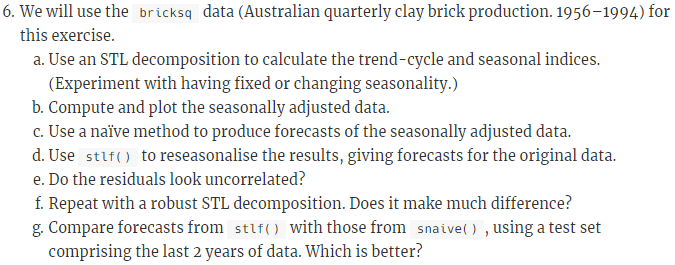
##### a) Use an STL decomposition to calculate the trend-cycle and seasonal indices. (Experiment with having fixed or changing seasonality.)


```{r }
stl_brickfixed <- stl(bricksq, s.window = "periodic",robust = TRUE)
autoplot(stl_brickfixed) +ggtitle("Brick Data with fixed seasonality")
```


```{r }
stl_brickchange <- stl(bricksq,s.window = 5,robust = TRUE)
autoplot(stl_brickchange) +ggtitle("Brick Data with changing seasonality")
```


##### b) Compute and plot the seasonally adjusted data.
Here we are  showing the trend-cycle component and the seasonally adjusted data, along with the original data.
```{r }
# plot data which are decomposed by STL with fixed seasonality
autoplot(bricksq, series = "Data") +
  autolayer(trendcycle(stl_brickfixed),
            series = "Trend-cycle") +
  autolayer(seasadj(stl_brickfixed),
            series = "Seasonally Adjusted Data") +
  ggtitle("brick production fixed seasonality") +
  scale_color_manual(values = c("gray", "red", "blue"),
                     breaks = c("Data", "Trend-cycle", "Seasonally Adjusted Data"))
# plot data which are decomposed by STL with changing seasonality
autoplot(bricksq, series = "Data") +
  autolayer(trendcycle(stl_brickchange),
            series = "Trend-cycle") +
  autolayer(seasadj(stl_brickchange),
            series = "Seasonally Adjusted Data") +
  ggtitle("brick production changing seasonality") +
  scale_color_manual(values = c("gray", "red", "blue"),
                     breaks = c("Data", "Trend-cycle", "Seasonally Adjusted Data"))

```


##### c) Use a naïve method to produce forecasts of the seasonally adjusted data.
```{r }
stl_brickfixed %>% seasadj() %>% naive() %>% autoplot() + 
  ggtitle(label = "Naive forecast of fixed seasonal brick data")
stl_brickchange %>% seasadj() %>% naive() %>% autoplot() + 
  ggtitle(label = "Naive forecast of change seasonal adjusted brick data")
```
From the above we can see that the prediction intervals of seasonally adjusted data decomposed by STL with changing seasonality have smaller range than the one with fixed seasonality. It happened because the variance of the remainder component decreased when the seasonality can be changed.


##### d) Use stlf() to reseasonalise the results, giving forecasts for the original data.

```{r}
fcast <- stlf(bricksq, method='naive')
autoplot(fcast)
```


##### e) Do the residuals look uncorrelated?

```{r}
checkresiduals(fcast)


```
The residuals are correlated with each other.


##### f) Repeat with a robust STL decomposition. Does it make much difference?


```{r}
stlf_brickrobust <- stlf(bricksq, robust = TRUE)
autoplot(stlf_brickrobust)
checkresiduals(stlf_brickrobust)
```
It looked like the autocorrelations became lower generally, but there are still some high values left.


##### g) Compare forecasts from stlf() with those from snaive(), using a test set comprising the last 2 years of data. Which is better?
 
Splitting data into test and train data set and then applying stlf and snaive on the train data.
```{r}
#subsetting train data set leaving last 2 years
train_brick <- subset(bricksq, 
                        end = length(bricksq) - 8)
#subsetting test data set including only last 2 years data
test_brick <- subset(bricksq,
                        start = length(bricksq) - 7)

snaive_bricksq_train <- snaive(train_brick)

stlf_bricksq_train <- stlf(train_brick, robust = TRUE)
# plot data and forecast results
autoplot(bricksq, series = "Original data") +
  autolayer(stlf_bricksq_train, PI = FALSE, size = 1,
            series = "stlf") +
  autolayer(snaive_bricksq_train, PI = FALSE, size = 1,
            series = "snaive") +
   scale_color_manual(values = c("gray50", "blue", "red"),
                     breaks = c("Original data", "stlf", "snaive")) +
  scale_x_continuous(limits = c(1990, 1994.5)) +
  scale_y_continuous(limits = c(300, 600)) +
  guides(colour = guide_legend(title = "Data")) +
  ggtitle("Forecast from stlf and snaive functions") 
  
accuracy(snaive_bricksq_train,test_brick)
accuracy(stlf_bricksq_train,test_brick)

```

From the above forescast plot we can see that the forecasts from stlf function are more similar to the original data than the forecasts from snaive function.stlf function can also use trend, and its seasonality can change over time. The test set have trend with seasonality.Sometimes, different accuracy measures will lead to different results as to which forecast method is best. However, in this case, all of the results point to the stlf method as the best method for this data set.

##### <span style="color:blue"><b><u>KJ# 3.1</u></b></span>
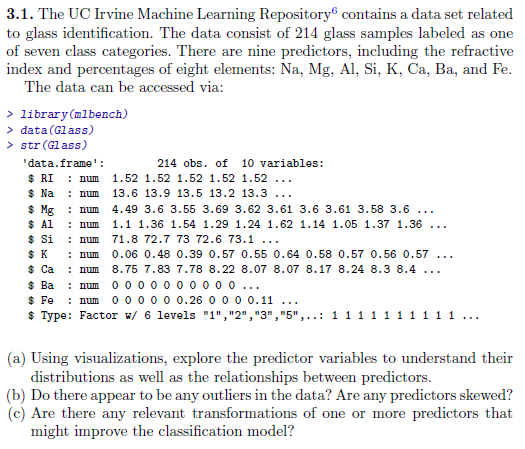
```{r}
```

##### <span style="color:blue"><b><u>KJ# 3.2</u></b></span>
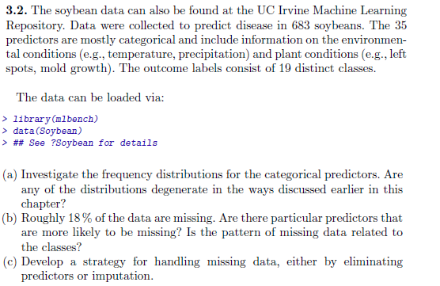
```{r}
```

##### <span style="color:blue"><b><u>HA# 7.5</u></b></span>

##### a) Plot the series and discuss the main features of the data. 

```{r}
bookdata <- window(books)
autoplot(bookdata) +
  xlab("Day") + ylab("Books Sold")
```

The plot shows that the data has an upwards trend over the 30 days. The trend does seem to be linear. There is a correlation between the paperback and hardcover sales. Whenever a spike occurs in the paperback sales, a dip in the hardcover sales occurs. The spikes is sales may also show a seasonal trend that is dependent on the day of the week.

##### b) Use the ses() function to forecast each series, and plot the forecasts.

Plot for Paperback using SES function
```{r}
#Simple smoothing for Paperbacks
fc.p <- ses(bookdata[,1])

autoplot(fc.p) +
  autolayer(fitted(fc.p), series="Fitted") +
  ylab("Paperback Sales") + xlab("Day") +
  ggtitle("Paperback SES")
```

Forecast data for Paperbacks

```{r}
fc.p
```

Plot for Hardcover using SES function
```{r}
#Simple smoothing for Hardcovers
fc.h <- ses(bookdata[,2])

autoplot(fc.h) +
  autolayer(fitted(fc.h), series="Fitted") +
  ylab("Hardcover Sales") + xlab("Day") +
  ggtitle("Harccover SES")
```

Forecast data for Hardcovers

```{r}
fc.h
```

##### c) Compute the RMSE values for the training data in each case.

The SES model provides us with the Mean Squared Error already, by calculating the square root of that number we can find the RMSE.

```{r}
x <- sqrt(fc.p$model$mse)
y <- sqrt(fc.h$model$mse)

print(paste0("RMSE for Paperbacks is ",x))
print(paste0("RMSE for Hardcovers is ",y))
```


##### <span style="color:blue"><b><u>HA# 7.6</u></b></span>
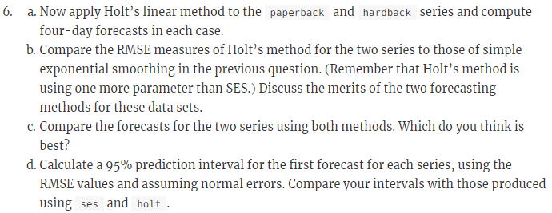
##### a) Apply Holt's linear method to the paperback and hardback series and compute four-day forecasts in each case.

Holt's linear method for paperback and the four-day forecasts
```{r}
#Holt's linear method for Paperback

holt.p <- holt(bookdata[,1], h=4)
holt.p
```

Holt's linear method for hardcover and the four-day forecasts
```{r}
#Holt's linear method for Hardcover

holt.h <- holt(bookdata[,2], h=4)
holt.h
```

##### b) Compare the RMSE measures of Holt's method for the two series to those of simple exponential smoothing in the previous question.  (Remember that Holt's method is using one more parameter that SES). Discuss the merits of the two forecasting methods for these data sets.

```{r}
hx <- sqrt(holt.p$model$mse)
hy <- sqrt(holt.h$model$mse)

print(paste0("SES RSME for Paperback is ", round(x,2)))
print(paste0("Holt RSME for Paperback is ", round(hx,2)))
cat('\n')
print(paste0("SES RSME for Hardcover is ", round(y,2)))
print(paste0("Holt RSME for Hardcover is ", round(hy,2)))
```

The RMSE values for Holt's linear method are smaller which indicates this method has more accurate predicted values than the simple exponential smoothing method.  Both methods use a smoothing level equation which is a weighted average observation between the mose recent observation and the previous one but Holt's method also uses a trend smoothing equation. This equation calculates the weighted average of the estimated trend at a time based on the current level estimate and previous trend estimate. This method is more accurate especially if the data shows a trend but is also more complicate because of the added variable.

##### c) Compare the forecasts for the two series using both methods.  Which do you think is best?

Paperback forecasts

```{r}
autoplot(bookdata[,1]) +
  autolayer(fc.p, series="SES", PI=FALSE) +
  autolayer(holt.p, series="Holt", PI=FALSE) +
  ggtitle("Forecasts for Paperback Sales") +
  ylab("Paperback Sales") + xlab("Day") + 
  guides(colour=guide_legend(title="Forecast"))
```

Hardcover forecasts

```{r}
autoplot(bookdata[,2]) +
  autolayer(fc.h, series="SES", PI=FALSE) +
  autolayer(holt.h, series="Holt", PI=FALSE) +
  ggtitle("Forecasts for Hardcover Sales") +
  ylab("Hardcover Sales") + xlab("Day") + 
  guides(colour=guide_legend(title="Forecast"))
```

We can see from the plotted forecasts that Holt's linear method takes into account the slope of the trend. The simple exponential smoothing only uses the last two steps as it's weighted measures for predictions so Holt's method is clearly better in this case.

##### d) Calculate a 95% prediction interval for the first forecast for each series using the RMSE values and assuming normal errors.  Compare your intervals with those produced using ses and holt.


```{r}
#SES prediction intervals
pred.pap.ses.low <- bookdata[30,1] - (1.96*x)
pred.pap.ses.high <- bookdata[30,1] + (1.96*x)

pred.hard.ses.low <- bookdata[30,2] - (1.96*y)
pred.hard.ses.high <- bookdata[30,2] + (1.96*y)

pred.pap.holt.low <- bookdata[30,1] - (1.96*hx)
pred.pap.holt.high <- bookdata[30,1] + (1.96*hx)

pred.hard.holt.low <- bookdata[30,2] - (1.96*hy)
pred.hard.holt.high <- bookdata[30,2] + (1.96*hy)

print(paste0("SES Paperback 95% Prediction Interval is [",round(pred.pap.ses.low,2),",",round(pred.pap.ses.high,2),"]"))
print(paste0("SES Hardcover 95% Prediction Interval is [",round(pred.hard.ses.low,2),",",round(pred.hard.ses.high,2),"]"))
cat()
print(paste0("Holt Paperback 95% Prediction Interval is [",round(pred.pap.holt.low,2),",",round(pred.pap.holt.high,2),"]"))
print(paste0("Holt Hardcover 95% Prediction Interval is [",round(pred.hard.holt.low,2),",",round(pred.hard.holt.high,2),"]"))
```

The prediction intervals from the two methods show that Holt's methods have a narrower prediction interval meaning the next forecasted value is more 'zoned in' that the SES method. The smaller variance means the calculated error from the actual value is smaller. 

##### <span style="color:blue"><b><u>HA# 7.10</u></b></span>

##### a) Plot the data and describe the main features of the series.

```{r}
uk <- window(ukcars)

autoplot(uk) +
  ylab("Cars Produced") + xlab("Year")
```

The plot shows that the data has seasonality fluctuations depending on the time of the year. It also shows that the data may have a slight cyclical effect as the trend decreases pre-1980 and after 2000. 

##### b) Decompose the series using STL and obtain the seasonally adjusted data.

```{r}
stl.data <- stl(uk, t.window=13, s.window='periodic', robust = TRUE)

autoplot(stl.data) +
  ggtitle("STL Decomposition")
```
STL Seasonal Data Plot

```{r}
stl.season <- seasadj(stl.data)

autoplot(stl.season) +
  ggtitle("Seasonally Adjusted Data Plot") +
  ylab("UK Car Production") + xlab("Year")
```

Sample of the adjusted seasonal data

```{r}
head(stl.season, 20)
```

##### c) Forecast the next two years of the series using an additive damped trend method applied to the seasonally adjusted data. (This can be done in one step using stlf() with arguments etsmodel="AAN", damped=TRUE .)

```{r}
fcast <- stlf(uk, t.window = 13, s.window= 'periodic', etsmodel='AAN', damped=TRUE)

autoplot(fcast) +
  ggtitle("STLF Forecast ~ 2years") +
  xlab("Year") + ylab("UK Car Production")
```

Forecasted mean for next two years.
```{r}
fcast$mean
```

##### d) Forecast the next two years of the series using Holt's linear method applied to the seasonally adjusted data (as before but with damped=FALSE)

```{r}
#h=8 for the next 8 quarters (or 2 years)
holt.fc <- holt(stl.season, h=8, damped=FALSE)

autoplot(holt.fc) +
  xlab("Year") + ylab("UK Car Production")
```

Holt's forecasted mean for next two years.
```{r}
holt.fc$mean
```

##### e) Now use ets() to choose a seasonal model for the data.

```{r}
model <- ets(stl.season)

summary(model)
```

The ETS function has chosen model ETS(A,N,N) as the model of best fit.

##### f) Compare the RMSE of the ETS model with the RMSE of the models you obtained using STL decompisitions.  Which gives the better in-sample fits?

```{r}
fcast.rmse <- sqrt(fcast$model$mse)

holt.rmse <- sqrt(holt.fc$model$mse)

ets.rmse <- sqrt(model$mse)

print(paste0("RMSE for the STLF method is: ", fcast.rmse))
cat('')
print(paste0("RMSE for the HOLT LINEAR method is: ", holt.rmse))
cat()
print(paste0("RMSE for the ETS method is: ", ets.rmse))
cat()
```

Though they are all very close, the STLF method does have a better fit when comparing RMSE's.

##### g) Compare the forecasts from the three approaches.  Which seems most reasonable?

```{r}
ets.fc <- model %>% 
  forecast(h=8)

autoplot(stl.season) +
  autolayer(fcast, series="STL", PI=FALSE) +
  autolayer(holt.fc, series="HOLT", PI=FALSE) +
  autolayer(ets.fc, series="ETS", PI=FALSE) +
  ggtitle("Forecasts of STL, HOLT, and ETS methods") +
  xlab("Year") + ylab("UK Car Production")
```

The STL model resembles a more realistic forecast compared to the other two. However, the holt model does include the increasing trend from 1980 forward. The data may also show a cyclical pattern where after 2000 the trend starts to decline which may give ETS an advantage.

##### h) Check the residuals of your preferred model.

```{r}
checkresiduals(fcast$residuals)
```

The lag plot shows that 5 autocorrelations are beyond the critical value boundaries. There is also a seaonal trend that is apparent so the ACF plot is not stationary.

##### <span style="color:blue"><b><u>HA# 8.1</u></b></span>
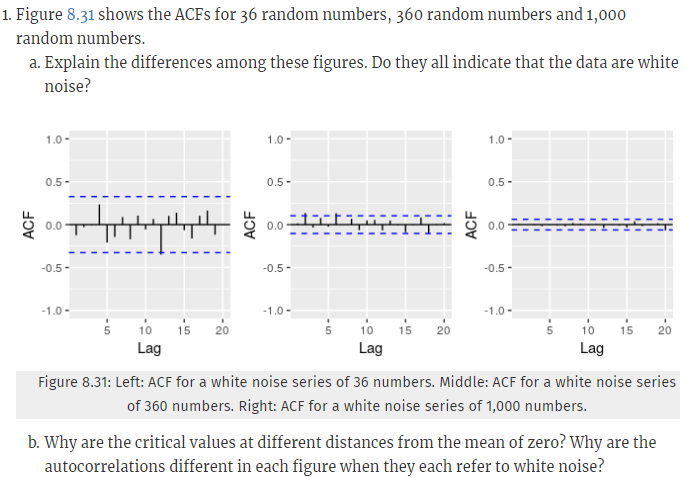
##### a) Explain the differences among these figures.  Do they all indicate that the data is white noise?

For these plots I would expect no more than 5% of the lags to exceed the 95% interval boundaries. Since only 20 lags are shown in the plots we have to make assumptions. If the plot is stationary then the properties do not depend on the time at which the series is observed. For the first plot, 1 out of 20 lags is beyond the boundary which is 5%. This could still be white noise but more tests should be done. The second plot has 3 out of 20 which is beyond 5% meaning this is not white noise. The third plot doesn't show any white does represent white noise. As for all the plots, there does not seem to be any apparent pattern or structure to the plots.

##### b) Why are the critical values at different distances from the mean of zero? Why are the autocorrelations different in each figure when they each refer to white noise?

The critical values are at different distances becuase of the equation $$\frac{2\pm }{ \sqrt{T}}$$ where $$T$$ is the number of values used. Since plot 1 has 36 random numbers the critical values are $$\frac{2\pm }{ \sqrt{36}}$$ or $$\pm 0.33$$.

The autocorrelations should be as close to zero as possible if it is white noise. As more lags become available, the confidence that the next lag will be near zero will be high. This is why the critical values shrink closer to zero with more numbers. 

##### <span style="color:blue"><b><u>HA# 8.2</u></b></span>
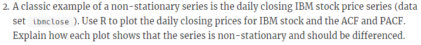
This problem is to plot the IBM closing stock price of IBM over a period of time, and examine it's lack of "stationariness".

First lets just plot the raw data.  From the plot, it is obvious (as expected) that the data is not stationary.  There is an upward trend in the first third, then an accelerating downward trend in the second third, while the last third doesn't exhibit a clear trend.  The variability seems more pronounced in the first half of the graph, but that is perhaps only subjective.  There doesn't seem to be obvious seasonality, or cyclicity.

```{r}
library(fpp2)
autoplot(ibmclose)
```

##ACF PACF Plots
Below we print the plots of the ACF (auto correlation function) and the PACF (partial ACF) to further examine the non-stationariness as well as to how we might need to difference the series to make it stationary.

Looking at the ACF plot we see it is decaying slowly, a clear indication of non-stationary data.  Also the value of R is quite large, further indicating the series isn't stationary.

With the PACF model, we see 1 really large spike, this indicates differencing of 1 is probably all that is needed to make the data stationary.

```{r}
ggAcf(ibmclose)
ggPacf(ibmclose)
```
###Rerun After taking one difference.

Running the plots after we use the "diff" (difference) command, we see that data now doesn't show upward/downward trend, but the variance looks like it might be slightly larger, towards the end of the sequence.  In any case the ACF and PACF plots while still containing some spikes above the upper signifcance line, are only very slighly above, so the series is much closer to being a stationary series.

```{r}
ibmDiffed <- diff(ibmclose)
autoplot(ibmDiffed)
ggAcf(ibmDiffed)
ggPacf(ibmDiffed)
```


##### <span style="color:blue"><b><u>HA# 8.7</u></b></span>
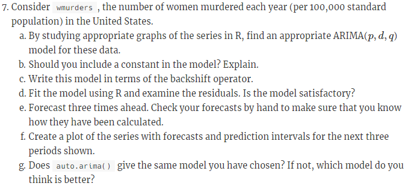
This problem deals with the dataset wmurders, which is a series containing the number of women murdered each year in the United States.
First lets run some plots to examine the data.  

From the raw plot of the data, we can definitely see obvious trend, with the murder rate climbing significantly through the 50's and 60's and then again with a strong decline from the early 90's to the early 2000's (until the end of the data).  Seasonal differences would not apply as the data is yearly and it is unlikely there is seasonal cycles of multiple years.


```{r}
autoplot(wmurders)

```

Unit Tests:
Rather than just relying on subject "eyeballing" of the plotted data, let's run some unit tests for more objectivity.  We will run the KPSS (Kwiatkowski-Phillips-Schmidt-Shin) and the Augemented Dickey Fuller Tests.  The results are below for both the intial raw data and the data differenced once.


```{r}
library(urca)
library(tseries)
summary(ur.kpss(wmurders))
summary(ur.kpss(diff(wmurders)))
adf.test(wmurders)
adf.test(diff(wmurders))
```

Interestingly, if we look at the KPSS test there doesn't seem to be a huge need to difference at all, the test statistics is under 1; differencing once does make that number even smaller though.  If we look at the ADF test though, the first result of 0.98 shows a strong need to difference, the result after differencing is much smaller at .0273, which indicates likely minimal trend, but we might wish to consider differencing twice to reduce further.

Anyhow, lets plot the differenced data (below).  From the plot of the differenced data, we see that the trend has been removed, although there definitely still seems to be some increase in variation as time goes along, with small variation in the early stages and larger ones as we move forward in time.  Plotting the 2nd order difference removes much of that variation, so perhaps 2 will be good for the "d" of the ARIMA model.


```{r}
diffWmurders <- diff(wmurders)
autoplot(diffWmurders)
secondOrderDiffWmurders <- diff(diff(wmurders))
autoplot(secondOrderDiffWmurders)
```

Now looking at the ACF and the PACF plots (below), we see one time containing a spike into the "significance" range.  This was at time period 2 for both graphs.  This suggests maybe having a "p" value of at least 1 for the ARIMA model.


```{r}
ggAcf(diffWmurders)
ggPacf(diffWmurders)

```


If we want to consider differencing a second time, let's look at the two ACF plots.  We see that the first lag in both plots is greater than negative 0.5, which may mean the plot is overdifferenced.  But leaving that aside for now, we see with both plots that they are sinusoidal, indicating that both a p and q parameter would make sense.  For the PACF, the first lag is significant so we should adding a parameter for the "q" or Moving Average (MA) part of the model.  In the ACF the first two lags are significant, indicating when we difference twice we should add 2 to the "p" or Autoregressive ARIMA parameter, but since the second is so much smaller and guidance from <a>https://people.duke.edu/~rnau/arimrule.htm<a> suggests that if we have both MA and AR terms, we may want to reduce one or both of those by 1, since they may cancel each other out.

```{r}
secondOrderDiffWmurders <- diff(diff(wmurders))
autoplot(secondOrderDiffWmurders)
ggAcf(secondOrderDiffWmurders)
ggPacf(secondOrderDiffWmurders)
```

So, we are left with a few choices for models, if we go with 1 order of differencing as we saw potential of over differencing with 2 orders, our model is (1,1,1).  If we choose 2 orders of differencing, we are left with either (1,2,2) as the likely choice, with the (1,2,1) also possible, if we lower the higher order MA term based on the comment from the Duke website.  Let's look at the 3 results:

```{r}
Arima(wmurders, c(1,1,1))
Arima(wmurders, c(1,2,2))
Arima(wmurders, c(1,2,1))
```
Looking at these results, the model with the lowest AIC values is actually (1,1,1).  So, the fact that has the lowest AIC, the fewest params (simpler) and the lowest variation and the least differencing, then this perhaps is the best model.  But (not shown), in checking the residuals for the (1,1,1) they were not as satisfactory.  So that leaves the other models, of the two, the (1,2,2) has very marginally better results for AIC and the BIC is noticably worse, and since the it is slighly more complex, I will suggest the best model is ARIMA(1,2,1),


##8.11.7.B
Should a constant be part of the model?  Normally if the model is differenced (which in our case is yes) and especially differenced more than once, then a constant is not included, so we shall not include a constant in our model.

##8.11.7.C
Using backshift notation, describe the differencing for our model.  Since we are differencing twice, we need to compute $(1-B)^2y_{t}$.  The full equation is:

$y_{t}^{''} = y_{t} - 2y_{t-1} + y_{t-2} =(1 - 2B + B^2)y_{t} = (1-B)^2y_{t}$

##8.11.7.D
Fitting our ARIMA model in R and examing the residuals, see the plots below:

```{r}
fitted <- Arima(wmurders, c(1,2,1))
scatter.smooth(fitted$residuals)
checkresiduals(fitted)
Box.test(fitted$residuals, type="Ljung-Box")
```

The residuals look reasonable.  They are evenly balanced around the mean.  There are some outliers at 1977 and 2001, this is where the actual data had a sharp change in direction, i.e., there were a greatly fewer murders in 1977 and greatly more in 2001 than in the prior year.  Not too suprisingly the model isn't handling those well.  The residuals do have a downward slope, so the model isn't perfect.  Also the ACF plot shows that the residuals are in tolerance, so basically these residuals are acceptable.

##8.11.7.E and 8.11.7.F
Forecasting using our model.

```{r}
forecast(fitted, h=3)
autoplot(forecast(fitted, h=3))

```

##8.7.G
Comparing our model to what auto.ARIMA has generated.

Below we see that the auto.ARIMA function also chose a (1,2,1) model.  Of course as noted way above, the (1,2,2) model could also be considered as an acceptable choice, and if one plots this (not done here for brevity, we see similar results to the above forecast plots).


```{r}
auto.arima(wmurders)
```


##### <span style="color:blue"><b><u>HA# 8.12</u></b></span>
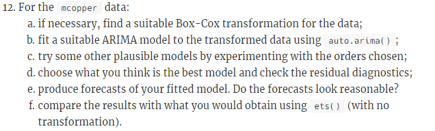
##8.11.12.A

This problem works on the mcopper dataset.  First lets look at the data.
```{r}
autoplot(mcopper)
```

This looks like it needs a transformation, as the data shows variation over time.  So let's find an appropriate lambda value (0.191) for the transformation and plot that.  We see doing this, that the variation is much less now from the early (left) portion of the time series to later entries.


```{r}
lambda <- BoxCox.lambda((mcopper))
lambda
mCopperBCTransform <- BoxCox(mcopper, lambda)
autoplot(mCopperBCTransform)
```

##8.12.B

Now, let's find an ARIMA function that will allow us to forecast.  Using the R auto.Arima function we see that it predicts that an (0,1,1) model is appropriate.

```{r}
auto.arima(mcopper, lambda = lambda)
```

##8.12.C
Let's experiment and see if other models might work better.  First let's adjust to the auto.Arima's parameters to allow a deeper search of models.

```{r}
auto.arima(mcopper, lambda = lambda, stepwise = FALSE, approximation = FALSE)
```

We see that the model returned was the same (0,1,1).  So the autofunction even with deeper analysis, still feels (0,1,1) is appropriate.

We can do our own analysis (like in 8.11.7 above).  Doing the unit tests, we see that both the KPSS and Augmented Dickey fuller show lots of trend without differencing as KPSS test statistic was well over 1 and the ADF results was  substantially above 0.05 p-value, indicating trend.  Applying an order of differencing of 1, removed any signficant trend from the models as shown by these two tests.  So the having a "d" of one as indicated by auto.Arima seems correct.

```{r}
summary(ur.kpss(mCopperBCTransform))
summary(ur.kpss(diff(mCopperBCTransform)))
adf.test(mCopperBCTransform)
adf.test(diff(mCopperBCTransform))
```
Lets run ACF and PACF tests to see if the "p" and "q" values chosen by the auto.Arima seem accurate as well.  Note due to substantial trend, we will only do the ACF tests on the data we already differenced.

```{r}
acf(diff(mCopperBCTransform))
Pacf(diff(mCopperBCTransform))
```

We see on both the ACF and PACF two lags substantially above the significance threshold, which indicates trying a (2,1,2) model.  Note there are a few other lags on each chart that are borderline significant, but making a model (5,1,5) is probably not wise, as it is likely we are overfitting at that point.  So let's try an ARIMA model of (2,1,2) and look at the results:

```{r}
Arima(mcopper, c(2,1,2), lambda = lambda)
```

So the AIC is worse with this model.  The log likelihood is pretty close, but once you add in the fact that we have 5 parameters vs 2 for the one the auto.arima found, then we see that AIC is noticeably lower for our choice.  (Note AIC is a function of log likelihood and the paramters).

Therefore we will chose the (0,1,1) as the best model.

##8.11.12.D
Using the (0,1,1) model let's examine the residuals.  The plots are below.  We see that the residuals look like white noise.  They are even around the 0 line with few outliers.  The ACF plot shows no residuals in the "significant" category and the Ljung-Box test shows a very high p value, again indicating residuals are essentially "white noise".

```{r}
fitted <- Arima(mcopper, c(0,1,1), lambda = lambda)
#fitted$residuals
checkresiduals(fitted)
Box.test(fitted$residuals, type="Ljung-Box")
```

##8.11.12.E

Forecasting the time series copper data.  we see that the forecast is essentially a straight line.  But the confidence levels are quite wide, meaning our predictions of a straight line is not that strong a prediction, the data could vary signifcantly.

```{r}
forecast(fitted)
autoplot(forecast(fitted))
```

##8.11.12.F

Compare the results of the ARIMA models to that achieved using ETS (error, trend, smoothing) model. From initial plotting, we see the forecast is quite noticeably lower ($\approx$ 3100 vs $\approx$ 3400), and the 80% and 95% tolerance levels are even slightly wider that the ARIMA's already wide intervals.

Comparing MSE's from the two tests, we see that the ARIMA models errors are smaller, indicating that it is likely the ARIMA model is performing better.

```{r}
autoplot(forecast(ets(mcopper, lambda = lambda)))
```

```{r}
fets <- function(x,h, lambda)
{
    forecast(ets(x, lambda = lambda), h = h)
}

farima <- function(x,h, lambda)
{
    forecast(auto.arima(x, lambda = lambda), h = h)
}

etsCopper <- tsCV(mcopper, fets, h=1, lambda = lambda)
arimaCopper <- tsCV(mcopper, farima, h=1, lambda = lambda)

mean(etsCopper^2, na.rm=TRUE)
mean(arimaCopper^2, na.rm=TRUE)

```


