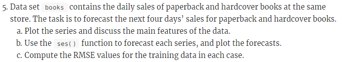
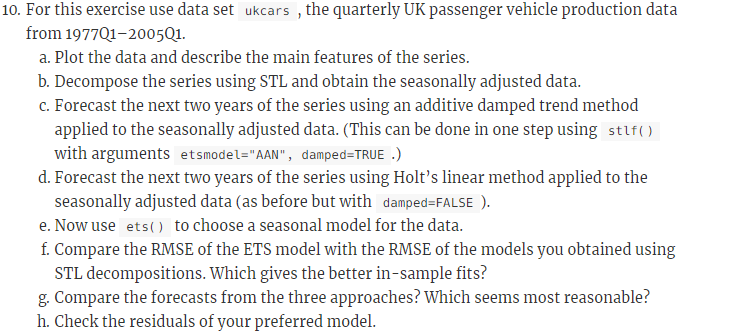

```{r setup, include=FALSE}
knitr::opts_chunk$set(echo = TRUE)
```
```{r}
library(mlbench)
library(tidyr)
library(dplyr)
library(ggplot2)
library(forecast)
library(fma)

```

##### <span style="color:blue"><b><u>HA# 2.3</u></b></span>

```{r}
```

##### <span style="color:blue"><b><u>HA# 2.7</u></b></span>

```{r}
```

##### <span style="color:blue"><b><u>HA# 2.10</u></b></span>

```{r}
```

##### <span style="color:blue"><b><u>HA# 3.1</u></b></span>

```{r}
```

##### <span style="color:blue"><b><u>HA# 3.8</u></b></span>


##### For your retail time series (from Exercise 3 in Section 2.10):

Loading the reatil data
```{r}
retaildata <- readxl::read_excel("retail.xlsx", skip=1)
myts <- ts(retaildata[,"A3349873A"],
  frequency=12, start=c(1982,4))
```
##### a) Split the data into two parts using

```{r }
myts.train <- window(myts, end=c(2010,12))
myts.test <- window(myts, start=2011)
```

##### b) Check that your data have been split appropriately by producing the following plot.

```{r}

autoplot(myts) + autolayer(myts.train, series="Training") +
  autolayer(myts.test, series="Test")
```

##### c) Calculate forecasts using snaive applied to myts.train.

```{r }
fc <- snaive(myts.train)
```

##### d) Compare the accuracy of your forecasts against the actual values stored in myts.test.

```{r }
accuracy(fc,myts.test)
```

##### e) Check the residuals.Do the residuals appear to be uncorrelated and normally distributed?

```{r }
checkresiduals(fc)
```

From the above it seems like residuals are correlated to each other.
Residuals are not normally distributed.

##### f) How sensitive are the accuracy measures to the training/test split?

```{r }
myts2.train <- window(myts, end=c(2011,12))
myts2.test <- window(myts, start=2012)
fc2 <- snaive(myts2.train)
accuracy(fc2,myts.test)
```
The accuracy measures are sensitive to the training/test split. Here we changed the train/test split percentage and run the accuracy check again and that reslts in low values in accuracy measure indicators. Comparing this to original matrix clearly indicates that the measures are sensitive to the split.

##### <span style="color:blue"><b><u>HA# 6.2</u></b></span>

##### a) Plot the time series of sales of product A. Can you identify seasonal fluctuations and/or a trend-cycle?

Loading the required libraries and plastics data
```{r }

plastics
ts(plastics)
plot(plastics,main = 'Plastic time plot')
```

From the above Time plot we can see there are seasonal fluctuations and upward trend.
Seasonal sales are peaking in summer.
Overall plot shows positive trnd with sales increasing yearly.


##### b) Use a classical multiplicative decomposition to calculate the trend-cycle and seasonal indices.

```{r }
plastic_model <- decompose(plastics, type="multiplicative")
trend <- plastic_model$trend #calculating trend
trend
seasonal <- plastic_model$seasonal # calculating seasonal indices
seasonal

```


##### c) Do the results support the graphical interpretation from part a?

Yes, the results support the graphical interpretation.The graph indicates that the summer months have higher  seasonal indices than the winter months


##### d) Compute and plot the seasonally adjusted data.

Here we are  showing the trend-cycle component and the seasonally adjusted data, along with the original data.

```{r }
autoplot(plastics, series="Data") +
  autolayer(trendcycle(plastic_model), series="Trend") +
  autolayer(seasadj(plastic_model), series="Seasonally Adjusted") +
  xlab("Year") + ylab("Monthly Sales in Thousands") +
  ggtitle("Plastic Sales") +
  scale_colour_manual(values=c("gray","blue","red"), breaks=c("Data","Seasonally Adjusted","Trend"))
```

##### e) Change one observation to be an outlier (e.g., add 500 to one observation), and recompute the seasonally adjusted data. What is the effect of the outlier?

Here we are adding 500 to 29th observation 
```{r }
outlier_plastic <- plastics
outlier_plastic[29] <- outlier_plastic[29] + 500
outlier_model <- decompose(outlier_plastic, type = "multiplicative")
```
Plot showing the trend-cycle component and the seasonally adjusted data, along with the original data with modified outlier data.

```{r }
autoplot(outlier_plastic, series = "Data") +
  autolayer(trendcycle(outlier_model), series = "Trend") +
  autolayer(seasadj(outlier_model), series = "Seasonally Adjusted") +
  xlab("Year") + ylab("Monthly Sales in Thousands") +
  ggtitle("Plastic Sales") +
  scale_color_manual(values=c("gray", "blue", "red"), breaks=c("Data", "Seasonally Adjusted", "Trend"))
```

We can see from the above graph that outlier doesnot have much effects on Trend cycle but it is highly effecting the seasonal data

##### f) Does it make any difference if the outlier is near the end rather than in the middle of the time series?
Here we are adding 500 to 52nd observation 
```{r }
outlierend_plastic <- plastics
outlierend_plastic[52] <- outlierend_plastic[52] + 500
outlierend_model <- decompose(outlierend_plastic, type = "multiplicative")
```
Plot showing the trend-cycle component and the seasonally adjusted data, along with the original data with modified outlier data
```{r }
autoplot(outlierend_plastic, series = "Data") +
  autolayer(trendcycle(outlierend_model), series = "Trend") +
  autolayer(seasadj(outlierend_model), series = "Seasonally Adjusted") +
  xlab("Year") + ylab("Monthly Sales in Thousands") +
  ggtitle("Plastic Sales") +
  scale_color_manual(values=c("gray", "blue", "red"), breaks=c("Data", "Seasonally Adjusted", "Trend"))
```
We can conclude that an outlier causes a spike in the month it is present by increasing seasonality index of that month.

##### <span style="color:blue"><b><u>HA# 6.6</u></b></span>

##### a) Use an STL decomposition to calculate the trend-cycle and seasonal indices. (Experiment with having fixed or changing seasonality.)


```{r }
stl_brickfixed <- stl(bricksq, s.window = "periodic",robust = TRUE)
autoplot(stl_brickfixed) +ggtitle("Brick Data with fixed seasonality")
```


```{r }
stl_brickchange <- stl(bricksq,s.window = 5,robust = TRUE)
autoplot(stl_brickchange) +ggtitle("Brick Data with changing seasonality")
```


##### b) Compute and plot the seasonally adjusted data.
Here we are  showing the trend-cycle component and the seasonally adjusted data, along with the original data.
```{r }
# plot data which are decomposed by STL with fixed seasonality
autoplot(bricksq, series = "Data") +
  autolayer(trendcycle(stl_brickfixed),
            series = "Trend-cycle") +
  autolayer(seasadj(stl_brickfixed),
            series = "Seasonally Adjusted Data") +
  ggtitle("brick production fixed seasonality") +
  scale_color_manual(values = c("gray", "red", "blue"),
                     breaks = c("Data", "Trend-cycle", "Seasonally Adjusted Data"))
# plot data which are decomposed by STL with changing seasonality
autoplot(bricksq, series = "Data") +
  autolayer(trendcycle(stl_brickchange),
            series = "Trend-cycle") +
  autolayer(seasadj(stl_brickchange),
            series = "Seasonally Adjusted Data") +
  ggtitle("brick production changing seasonality") +
  scale_color_manual(values = c("gray", "red", "blue"),
                     breaks = c("Data", "Trend-cycle", "Seasonally Adjusted Data"))

```


##### c) Use a naïve method to produce forecasts of the seasonally adjusted data.
```{r }
stl_brickfixed %>% seasadj() %>% naive() %>% autoplot() + 
  ggtitle(label = "Naive forecast of fixed seasonal brick data")
stl_brickchange %>% seasadj() %>% naive() %>% autoplot() + 
  ggtitle(label = "Naive forecast of change seasonal adjusted brick data")
```
From the above we can see that the prediction intervals of seasonally adjusted data decomposed by STL with changing seasonality have smaller range than the one with fixed seasonality. It happened because the variance of the remainder component decreased when the seasonality can be changed.


##### d) Use stlf() to reseasonalise the results, giving forecasts for the original data.

```{r}
fcast <- stlf(bricksq, method='naive')
autoplot(fcast)
```


##### e) Do the residuals look uncorrelated?

```{r}
checkresiduals(fcast)


```
The residuals are correlated with each other.


##### f) Repeat with a robust STL decomposition. Does it make much difference?


```{r}
stlf_brickrobust <- stlf(bricksq, robust = TRUE)
autoplot(stlf_brickrobust)
checkresiduals(stlf_brickrobust)
```
It looked like the autocorrelations became lower generally, but there are still some high values left.


##### g) Compare forecasts from stlf() with those from snaive(), using a test set comprising the last 2 years of data. Which is better?
 
Splitting data into test and train data set and then applying stlf and snaive on the train data.
```{r}
#subsetting train data set leaving last 2 years
train_brick <- subset(bricksq, 
                        end = length(bricksq) - 8)
#subsetting test data set including only last 2 years data
test_brick <- subset(bricksq,
                        start = length(bricksq) - 7)

snaive_bricksq_train <- snaive(train_brick)

stlf_bricksq_train <- stlf(train_brick, robust = TRUE)
# plot data and forecast results
autoplot(bricksq, series = "Original data") +
  autolayer(stlf_bricksq_train, PI = FALSE, size = 1,
            series = "stlf") +
  autolayer(snaive_bricksq_train, PI = FALSE, size = 1,
            series = "snaive") +
   scale_color_manual(values = c("gray50", "blue", "red"),
                     breaks = c("Original data", "stlf", "snaive")) +
  scale_x_continuous(limits = c(1990, 1994.5)) +
  scale_y_continuous(limits = c(300, 600)) +
  guides(colour = guide_legend(title = "Data")) +
  ggtitle("Forecast from stlf and snaive functions") 
  
accuracy(snaive_bricksq_train,test_brick)
accuracy(stlf_bricksq_train,test_brick)

```

From the above forescast plot we can see that the forecasts from stlf function are more similar to the original data than the forecasts from snaive function.stlf function can also use trend, and its seasonality can change over time. The test set have trend with seasonality.Sometimes, different accuracy measures will lead to different results as to which forecast method is best. However, in this case, all of the results point to the stlf method as the best method for this data set.

##### <span style="color:blue"><b><u>KJ# 3.1</u></b></span>

```{r}
```

##### <span style="color:blue"><b><u>KJ# 3.2</u></b></span>

```{r}
```

##### <span style="color:blue"><b><u>HA# 7.5</u></b></span>

```{r}
```

##### <span style="color:blue"><b><u>HA# 7.6</u></b></span>

```{r}
```

##### <span style="color:blue"><b><u>HA# 7.10</u></b></span>

```{r}
```

##### <span style="color:blue"><b><u>HA# 8.1</u></b></span>

```{r}
```

##### <span style="color:blue"><b><u>HA# 8.2</u></b></span>

```{r}
```

##### <span style="color:blue"><b><u>HA# 8.7</u></b></span>

```{r}
```

##### <span style="color:blue"><b><u>HA# 8.12</u></b></span>

```{r}
```


