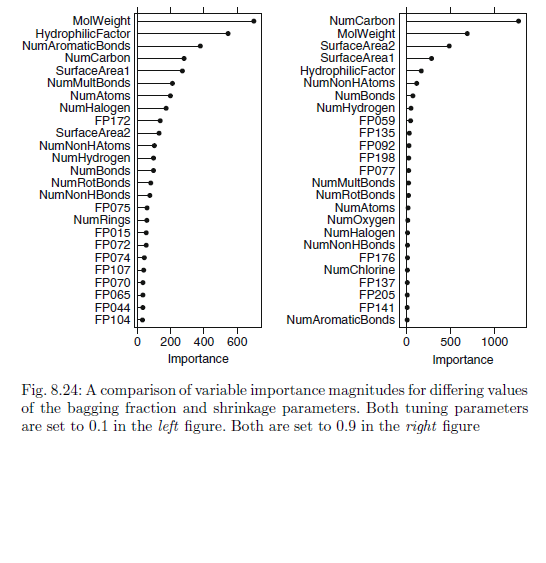
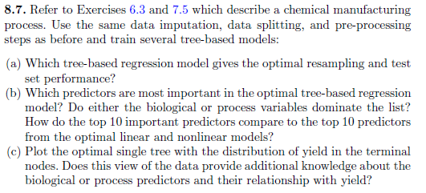

{\rtf1\ansi\ansicpg1252\cocoartf1671\cocoasubrtf200
{\fonttbl\f0\fswiss\fcharset0 Helvetica;}
{\colortbl;\red255\green255\blue255;}
{\*\expandedcolortbl;;}
\margl1440\margr1440\vieww10800\viewh8400\viewkind0
\pard\tx720\tx1440\tx2160\tx2880\tx3600\tx4320\tx5040\tx5760\tx6480\tx7200\tx7920\tx8640\pardirnatural\partightenfactor0

\f0\fs24 \cf0 ---\
title: 'DATA 624 Spring 2019: Homework-2'\
author: "Ahmed Sajjad, Harpreet Shoker, Jagruti Solao, Chad Smith, Todd Weigel"\
output:\
  word_document: default\
  pdf_document: default\
  html_document:\
    df_print: paged\
---\
\
\
```\{r,message=FALSE\}\
library(dplyr)\
library(ggplot2)\
library(pander)\
library(tibble)\
library(purrr)\
library(tidyr)\
library(stringr)\
library(readr)\
library(forcats)\
library(earth)\
library(Formula)\
library(plotmo)\
library(plotrix)\
library(TeachingDemos)\
library(rpart)\
library("rpart.plot")\
library(mlbench)\
library(caret)\
library(mice)\
library(corrplot)\
library(olsrr)\
library(nnet)\
library(kernlab)\
library(rminer)\
library(AppliedPredictiveModeling)\
library(DMwR)\
library(party)\
library(ipred)\
library(randomForest)\
library(gbm)\
library(Cubist)\
library(party)\
```\
\
\
\
\
\
\
#### a) Start R and use the following commands to load the data. The matrix 'processPredictors' contains 57 predictors (12 describing the input biological material and 45 describing the process predictors) for the 176 manufacturing runs. 'yield' contains the percent yield for each run.\
\
\
```\{r\}\
library(AppliedPredictiveModeling)\
data(ChemicalManufacturingProcess)\
processPredictors <- ChemicalManufacturingProcess\
```\
\
#### b) A small percentage of cells in the redictor set contain missing values. Use an imputation function to fill in these missing values\
\
The summary for this dataset shows that many columns have 5 or less missing values. The column 'ManufacturingProcess03' had the most missing values with 15.\
\
```\{r\}\
summary(processPredictors)\
```\
\
Using the MICE package, the 'predictive mean matching' method was used to impute missing values on the dataset.  \
It ran through 50 iterations.\
\
```\{r message=FALSE, include=FALSE\}\
imputedData <- mice(processPredictors, m=1, maxit=50, method = 'pmm')\
completeData <- complete(imputedData,1)\
```\
\
Summary of the completed dataset shows all missing values have been imputed.\
\
```\{r\}\
summary(completeData)\
```\
\
#### c) Split the data into a training and a test set, pre-process the data, and tune a model of your choice from this chapter.  What is the optimal value of the performance metric?\
\
```\{r\}\
#Smallest negative value is -1.8 so we'll add 2 to the column to make it positive for log tranformations\
completeData$ManufacturingProcess21 <- completeData$ManufacturingProcess21 + 2\
## 75% of the sample size\
smp_size <- floor(0.75 * nrow(completeData))\
## set the seed to make your partition reproducible\
set.seed(123)\
train_ind <- sample(seq_len(nrow(completeData)), size = smp_size)\
train <- completeData[train_ind, ]\
test <- completeData[-train_ind, ]\
```\
\
Pre-Process and transform the Data\
\
```\{r\}\
y <- train$Yield\
train.trim <- subset(train, select = -c(Yield))\
#The preProcess function returns a list of elements, such as vectors of standard deviations\
# and vector of means since scale and center were reqeuested.\
prepro_set <- preProcess(train.trim, method = c('scale', 'center'))\
print(prepro_set)\
#The predict function uses the list of elements to produce a dataframe of pre-processed variables\
transformed_train <- predict(prepro_set, train.trim)\
```\
\
Building the Model using all predictor variables.\
\
```\{r\}\
transformed_train$Yield <- y\
model1 <- lm(Yield ~., data = transformed_train)\
summary(model1)\
```\
\
The R-Squared value is at 0.8072 which tells us that the model is a decent fit for the data.  The Adjusted R-Squared value decreases to 0.6632 which also tells us that many of predictors do not improve the model as much as they should. None of the predictors show to be significant to the model since most have high p-values. \
\
*Tuning the Model*\
\
Using backward stepwise regression. This takes all the variables and removes them based on their p-value. The variables left have the most significant impact on the model. \
\
```\{r\}\
model.tune <- lm(Yield ~., data = transformed_train)\
k <- ols_step_backward_p(model.tune)\
```\
\
```\{r\}\
x <- k$removed\
print(x)\
```\
\
\
The stepwise model removed all variables with a low p-value leaving. A total of 21 variables were removed, the majority of them ManufacturingProcess variables. The R-Squared value was almost the exact same at 0.796 with an Adjusted R-Square value at 0.722.  With less variables without losing accuracy, I would use this as the primary model. \
\
#### d) Predict the response for the test set.  What is the value of the performance metric and how does this compare with the resampled performance metric on the training set?\
\
```\{r\}\
y_test <- test$Yield\
test.tune <- subset(test, select = -c(Yield))\
#Drop columns that were removed in the previous backward stepwise model\
test.tune <- test.tune[, !(names(test.tune) %in% x)]\
#The preProcess function returns a list of elements, such as vectors of standard deviations\
# and vector of means since scale and center were reqeuested.\
test_set <- preProcess(test.tune, method = c('scale', 'center'))\
print(test_set)\
#The predict function uses the list of elements to produce a dataframe of pre-processed variables\
transformed_test <- predict(test_set, test.tune)\
pred <- predict(k$model, transformed_test)\
```\
\
```\{r\}\
qplot(seq_along(transformed_train$Yield), transformed_train$Yield, ylab = 'Yield', xlab = 'Index', main = 'Yield Actual Data', geom = 'point')\
```\
\
```\{r\}\
qplot(seq_along(pred), pred, ylab = 'Yield', xlab = 'Index', main = 'Yield Predicted Data', geom = 'point')\
```\
\
RSME for predicted values\
```\{r\}\
RMSE(pred, y_test)\
```\
\
The performance metric was worse for the predicted data than the training data. Using the RSME metric, the training data had a 0.945.  The testing data showed a 4.11 with the plots clearly showing how big the variance is between actual and predicted data. \
\
#### e) Which predictors are most important in the model you have trained?  Do either the biological or process predictors dominate the list?\
\
The original dataset had 12 biological predictors and 45 process predictors. The backwards stepwise regression function dropped 3 biological and 15 process predictors, or 25% and 33% respectively.  Process predictors dominate the list but the stepwise model calculated the a higher percentage of those were insignificant to the model.\
\
#### f) Explore the relationships between each of the top predictors and the response. How could this information be helpful in improving yield in future runs of the manufacturing process?\
\
```\{r\}\
summary(k$model)\
```\
\
Top predictor variables in this model is BiologicalMaterial03, BiologicalMaterial06, BiologicalMaterial09, ManufacturingProcess29, ManufacturingProcess32, and ManufacturingProcess37 based on their p-values.\
\
These predictors were slightly significant with the model of all variables though they became very significant when the stepwise function dropped insignificant variables.\
\
```\{r\}\
top <- subset(test, select = c(Yield, BiologicalMaterial03, BiologicalMaterial06, BiologicalMaterial09,\
                               ManufacturingProcess29, ManufacturingProcess32, ManufacturingProcess37))\
m <- cor(top)\
corrplot(m, method = 'circle')\
```\
\
From the correlation plot we see the BiologicalMaterial03 and 06 are highly correlated and may be redundant in the model.  For the Manufacturing Process predictors, #32 seems to be the most correlated with the Yield. For future runs, more attention could be made to this process to help improve the yield. \
\
\
\
\
\
```\{r\}\
library(mlbench)\
set.seed(200)\
# training data set\
trainingData   = mlbench.friedman1(200, sd = 1)\
trainingData$x = data.frame(trainingData$x)\
# test data set\
testData       = mlbench.friedman1(5000, sd = 1)\
testData$x     = data.frame(testData$x)\
```\
\
We are going to investigate the relationship between the predictors `X1`-`X10` and the response `y` in the training data:\
\
```\{r\}\
head(trainingData$x, 5)\
head(trainingData$y, 5)\
head(testData$x, 5)\
head(testData$y, 5)\
trainingData_df1 = mutate(trainingData$x, y=trainingData$y)\
trainingData_df2 = gather(trainingData_df1, var, x, X1:X10)\
trainingData_df2 = mutate(trainingData_df2, var = forcats::fct_relevel(factor(var), "X10", after = Inf))\
head(trainingData_df1)\
head(trainingData_df2)\
trainingData_df2 <- trainingData_df2[c("var", "x", "y")]\
head(trainingData_df2)\
tail(trainingData_df2)\
ggplot(trainingData_df2, aes(x, y)) + geom_point(color='red', alpha = 0.25) + \
  stat_smooth(method = "glm", se = FALSE) + facet_wrap(~ var, nrow = 2) \
```\
\
From the plot, we notice that the variables X1, X2, X4, & X5 show positive correlations with the response y.  The remaining variables appear to show near-zero correlation to the response.\
\
## Models\
We are going to test this with three models: \
1) K nearest neighbors model \
2) MARS model  \
3) SVM model \
\
### K Nearest Neighbors Model\
\
The K nearest neighbors model is used as the first model, with predictors centered and scaled:\
\
```\{r\}\
library(caret)\
set.seed(100)\
fried_knn = train(trainingData$x, trainingData$y, method = "knn", preProc = c("center", "scale"), tuneLength = 10)\
```\
\
The resampled RMSE of the model with various tuning parameters is shown below:\
```\{r\}\
ggplot(fried_knn, aes(x=k, y=RMSE)) + geom_line(color="green") + \
  geom_point(size = 1) + labs(title = "KNN model parameter vs. RMSE")\
```\
\
The optimal RMSE of this model occurs at $k$ = $9$, which yields an RMSE of 'r round(min(fried_knn$results), 3)'.\
\
### MARS Model\
\
MARS model is used as the second model. It is used with the same pre-processing as the KNN model above, for first- and second-degree products and pruning parameter from 1-20:\
\
```\{r\}\
set.seed(100)\
fried_mars = train(trainingData$x, trainingData$y, method = "earth", preProcess = c("center", "scale"), tuneGrid = expand.grid(degree = 1:2, nprune = 1:20))\
```\
\
The tuning profile of this model is shown below:\
\
```\{r\}\
ggplot(fried_mars$results, aes(x = nprune, y = RMSE, col = factor(degree))) + geom_line() + \
  geom_point(size = 1) + labs(title = "MARS model parameters vs. RMSE") + theme(legend.position = "top")\
```\
\
The optimal RMSE of 'r round(min(fried_marsresultsRMSE), 3)' is obtained with a second-degree model with 16 parameters. The importance of the predictors is shown below:\
\
'r pander::pander(varImp(fried_mars)[["importance"]])'\
\
We notice that the five informative predictors X1-X5 are the only predictors selected by the model.\
\
### SVM Model\
SVM Model is used as the third model. \
```\{r\}\
set.seed(100)\
fried_svm = train(trainingData$x, trainingData$y, method = "svmRadial", preProc = c("center", "scale"), tuneLength = 10)\
```\
\
The tuning profile of the model is shown below:\
```\{r\}\
ggplot(fried_svm$results, aes(x = C, y = RMSE)) + geom_line(color="blue") + \
  geom_point(size = 1) + scale_x_continuous(trans = "log2") + labs(title = "Radial SVM model parameter vs. RMSE") \
```\
\
##### The optimal RMSE of 'r round(min(fried_svmresultsRMSE), 3)' achieved with a cost parameter $C$ = $4$ and a shape parameter $\\sigma \\approx 'r round(fried_svm$results$sigma[[1]], 4)'$.  The RMSE of the model levels out above $C$ = $4$.\
\
## Model Performance\
Each of the models is used to predict for the test set, and their performance is measured:\
\
```\{r\}\
fried_knn_prediction  = predict(fried_knn, testData$x)\
fried_mars_prediction = predict(fried_mars, testData$x)\
fried_svm_prediction  = predict(fried_svm, testData$x)\
fried_knn_performance  = defaultSummary(data.frame(obs = testData$y, pred = fried_knn_prediction))\
fried_mars_performance = defaultSummary(data.frame(obs = testData$y, pred = fried_mars_prediction[, 1]))\
fried_svm_performance  = defaultSummary(data.frame(obs = testData$y, pred = fried_svm_prediction))\
pander(data.frame(RMSE = c(fried_knn_performance["RMSE"], \
                           fried_mars_performance["RMSE"], \
                           fried_svm_performance["RMSE"]),\
       row.names = c("KNN", "MARS", "SVM")))\
```\
\
We notice that the most accurate model is the **MARS model** based on the resampled RMSE and performance against the test set.\
\
\
\
\
\
#### a) Which nonlinear regression model gives the optimal resampling and test set performance.\
\
\
```\{r\}\
#Get testing data and scale and center it\
y_test <- test$Yield\
test.tune <- subset(test, select = -c(Yield))\
#The preProcess function returns a list of elements, such as vectors of standard deviations\
# and vector of means since scale and center were reqeuested.\
test_set <- preProcess(test.tune, method = c('scale', 'center'))\
#The predict function uses the list of elements to produce a dataframe of pre-processed variables\
transformed_test <- predict(test_set, test.tune)\
```\
\
\
Neural Network Regression Model\
\
```\{r\}\
y <- transformed_train$Yield\
X <- subset(transformed_train, select = -c(Yield))\
mod1 <- nnet(X, y, size = 10, linout = T, maxit = 500)\
pred1 <- predict(mod1, transformed_test)\
```\
\
Support Vector Machines\
\
```\{r\}\
mod2 <- train(X, y, method = 'svmRadial', tuneLength = 14, trControl = trainControl(method = 'cv'))\
mod2\
pred2 <- predict(mod2$finalModel, transformed_test)\
```\
K-Nearest Neighbors\
\
```\{r\}\
mod3 <- train(X, y, method = 'knn', tuneGrid = data.frame(.k = 1:20),\
              trControl = trainControl(method = 'cv'))\
mod3\
pred3 <- predict(mod3$finalModel, transformed_test)\
```\
\
Comparing RMSE for the three models:\
\
```\{r\}\
one <- RMSE(pred1, y_test)\
print(paste0('Neural Network RMSE: ', one))\
two <- RMSE(pred2, y_test)\
print(paste0('Support Vector Machines RMSE: ', two))\
three <- RMSE(pred3, y_test)\
print(paste0('k-Nearest Neighbors RMSE: ', three))\
```\
\
The Support Vector Machines model has the lowest RMSE giving us the best model.\
\
#### b) Which predictors are most important in the optimal nonlinear regression model? Do either biological or process variables dominate the list? How do the top ten important predictors compare to the top ten predictors from the optimal linear model?\
\
```\{r\}\
varImp(mod2)\
```\
\
The top predictor variables from the SVM model are shown above.  From that list, compared with the top linear regression model variables, 'ManufacturingProcess32', 'BiologicalMaterial03', and 'BiologicalMaterial06' were the only variables that were in both lists. \
\
With the SVM model, there were 6 Manufacturing variables and 4 Biological variables in the top ten list.  Considering there are many more Manufacturing variables than Biological variables overall, a higher percentage of Biological variables that were included may mean more significance in that context. \
\
#### c) Explore the relationships between the top predictors and the response for the predictors that are unique to the optimal nonlinear regression model.  Do these plots reveal intuition about the biological or process predictors and their relationship with yield?\
\
Below, the actual data is in Black while the predicted data is in Red.  We can see that the accuracy is very good and doesn't seem to have much variance in most of the graph. \
\
```\{r\}\
p <- data.frame('actual' = y_test, 'pred' = pred2)\
matplot(p, type = 'l', pch = 1)\
```\
\
```\{r\}\
#Calculate residuals\
res <- y_test-pred2\
plot(res)\
abline(h=0, col='red')\
```\
\
The residuals for this model seem to have a uniform variance though the variance may get greater towards the end. There doesn't seem to be any noticeable skew. \
\
```\{r\}\
top <- subset(test, select = c(Yield, ManufacturingProcess13, ManufacturingProcess17, BiologicalMaterial02,\
                               BiologicalMaterial12, ManufacturingProcess36, ManufacturingProcess06,\
                               ManufacturingProcess33, BiologicalMaterial11))\
m <- cor(top)\
corrplot(m, method = 'circle')\
```\
\
From these predictors we can see that many more variables are highly correlated. BioMaterial 11 and 12 are highly correlated as well as ManufProcess 13 and 17. An intuitive thought would be to look out for predictors that have negative correlation to Yield. ManufProcess13, 17, and 36 should be reformed or analyzed to understand why they are negatively correlated to Yield.\
\
\
\
\
\
## Problem 8.1 from Max Kuhn, Kjell Johnson\
\
####Setup\
\
```\{r\}\
set.seed(200)\
simulated <- mlbench.friedman1(200, sd =1)\
simulated <- cbind(simulated$x, simulated$y)\
simulated <- as.data.frame(simulated)\
colnames(simulated)[ncol(simulated)] <- "y"\
```\
\
###8.1A\
Fit a random forest to model to all predictors and estimate the importance scores of the variables.\
\
```\{r\}\
model1 <- randomForest(y ~ . , data= simulated, importance = TRUE, ntree = 1000)\
rfImp1 <- varImp(model1, scale = FALSE)\
rfImp1\
```\
\
Examining the predictors, we see that variable importance for variables 6-10, show that these variables do not contribute much.  Variable 6 has minimal predictive ability but 7-10 have very small importance values and are negative.\
\
\
\
###8.1B\
\
Now we will add another highly correlated predictor variable, and see how the model changes predictive weights.  First we add in a variable that is a slight variation on V1, and we see about 94% correlation.\
```\{R\}\
simulatedAddCorVar <- simulated\
simulatedAddCorVar$duplicate1 <- simulatedAddCorVar$V1 + rnorm(200) * .1\
cor(simulatedAddCorVar$duplicate1,  simulatedAddCorVar$V1)\
```\
\
Let's refit a model with the random forest model.  When we do that we see that the importance of V1 decreases with the new near "duplicative" predictor we added.  Basically adding a well correlated variable decreases the importance of the first variable.\
\
```\{r\}\
model1 <- randomForest(y ~ . , data= simulatedAddCorVar, importance = TRUE, ntree = 1000)\
rfImp1 <- varImp(model1, scale = FALSE)\
rfImp1\
```\
\
###8.1C\
Fit a different model, cforest, to the data, and examine the predictive values of the variables with this model.  We will check the variable importance with the varimp conditional flag set to true and false and compare the differences.  The conditional toggle will switch between weighting importance using traditional measures and those described by Strobl et al here:  https://bmcbioinformatics.biomedcentral.com/articles/10.1186/1471-2105-9-307</a>\
\
We see that the predictive values (with either toggle of the conditional flag), while not the same do closely mirror what we saw with the original random forest model, in that the relative importance of each predictor to the others has not changd (e.g., V3 in each model is less important the the other variables from V1-V5).  We also see with the conditional flag set, the predictive values of each of the first 5 variables are all closer together.\
\
```\{r\}\
model1 <- cforest(y ~ . , data= simulated, controls = cforest_unbiased(ntree = 1000))\
cfImp1 <- varimp(model1)\
cfImp1\
cfImp1 <- varimp(model1, conditional = TRUE)\
cfImp1\
```\
\
###8.1D\
\
We will repeat the above process with some other models: "bagged" tree, "boosted" tree model, as well as the Cubist model.\
\
First the bagged tree model.  Here we see that variable importance is noticeably different from the prior models.  V6-V10 are still do not have as great an importance, but their relative importance is higher.  And the importance between variables V1-V5 does not vary nearly as much as some of the other models.\
\
```\{r\}\
baggedTree <- bagging(y ~ ., data = simulated)\
bagImp1 <- varImp(baggedTree)\
bagImp1 \
```\
\
We also tried the bagged model with the additional correlated variable.  It's weighting of variable importance, unlike prior models did not change much with the addition of the correlated variable.\
```\{r\}\
baggedTree <- baggedTree <- bagging(y ~ ., data = simulatedAddCorVar)\
bagImp1 <- varImp(baggedTree)\
bagImp1\
```\
\
The Boosted Trees model.\
Here we see that this model suggests only using 4 variables as predictors (V1, V2, V4, V5).\
```\{r\}\
boostTreeModel <- gbm.fit(simulated[,1:10], simulated[,11], distribution = "gaussian", verbose = FALSE)\
boostImp <- varImp(boostTreeModel, numTrees = 100)\
boostImp\
```\
If we add in the additional correlated variable, we see that it reduces the predictive value of many of the variables as before.\
\
```\{r\}\
boostTreeModel <- gbm.fit(simulatedAddCorVar[,c(1:10,12)], simulatedAddCorVar[,11], distribution = "gaussian", verbose = FALSE)\
boostImp <- varImp(boostTreeModel, numTrees = 100)\
boostImp\
```\
Lastly now the Cubist model.\
\
It gives predictive values for four variables only (V1,V2,V4,V5) and interestingly, the predictive value for each of them is equally weighted.\
\
```\{r\}\
library(Cubist)\
cubistMod <- cubist(simulated[,1:10], simulated[,11])\
varImp(cubistMod)\
```\
\
If we add in the additional correlated variable to the cubst model, it does not affect the predictive value of the four variables that were predicive, it just adds in the correlated variable at the same predictive level.\
\
```\{r\}\
library(Cubist)\
cubistMod <- cubist(simulatedAddCorVar[,c(1:10,12)], simulatedAddCorVar[,11],)\
varImp(cubistMod)\
```\
\
\
\
\
### 8.2) Use a simulation to show tree bias with different granularities.\
\
Single regression trees are more diluted in result with single bias.Predictors with a higher number of distinct values (lower variance) are choosen over more granular (higher variance) predictors. data consisting of both informative and noise variables, and the noise variables have many more splits than the informative variables. There is therefore a high probability that the noise variables will be chosen to split the top nodes of the tree.\
\
\
```\{r\}\
library(rpart)\
library("rpart.plot")\
library(mlbench)\
library(caret)\
```\
\
```\{r\}\
set.seed(500)\
A <- rep(1:2, each=1000)\
z <- A + rnorm(200, mean=0, sd=4)\
\
set.seed(500)\
B <- rnorm(200, mean=0, sd=2)\
simData <- data.frame(z=z, A=A, B=B)\
\
set.seed(624)\
fit <- rpart(z ~ ., data = simData)\
```\
\
```\{r\}\
rpart.plot(fit)\
```\
\
```\{r\}\
varImp(fit) \
```\
\
In the simulation below,a predictor 'A' is created.Response variable Z is created that is equal to addition of 'A' and Gaussian variable with \uc0\u956 =0,\u963 =2 and a higher variance Gaussian variable B with \u956 =0,\u963 =4 is  created. These variables are then placed in a data frame and modeled using the rpart() function which makes splits. The varImp() function is used to calculate the variable importance for the model.\
\
The selection bias of Single Regression Trees is evident from this example. The lower variance predictor 'A' which is related to 'z' is found to be less important than the higher variance 'B' predictor which is completely unrelated to 'z'.The importance of the unrelated B predictor is not just more,it is almost more thant four times.\
\
\
\
#### 8.3)\
\
\
\
\
\
#### (a) Why does the model on the right focus its importance on just the first few of predictors, whereas the model on the left spreads importance across more predictors?\
\
Lower learning rate of 0.1 in the left model results in fewer predictors than the model on the right which has a 0.9 learning rate. As randomness increases,there is increase in number of predictors.Therefore, the lower bagging fraction of 0.1 in the left model results in fewer predictors than the more deterministic model on the right which selects 0.9 of the training set observations to propose the next tree in the expansion.\
\
#### (b) Which model do you think would be more predictive of other samples?\
\
Model with leraning rate of 0.9 is more prone to overfitting therefore model on the left with learning rate of 0.1 is more predictive of other samples.\
\
\
#### (c) How would increasing interaction depth affect the slope of predictor im-portance for either model in Fig. 8.24?\
\
1) The positive impact of interaction depth on RMSE is proportional to the learning rate and number of trees.\
2) An increase in interaction depth will increase the number of predictors and RMSE. Variable importance will be spread across more predictors and the Iterations graph will have a higher intercept that increases the negative slope.\
\
\
\
\
8.7  Refer to Exercises 6.3 and 7.5 which describe a chemical manufacturing process. Use the same data imputation, data splitting, and pre-processing steps as before and train several tree-based models:\
\
\
```\{r\}\
data("ChemicalManufacturingProcess")\
processPredictors <- ChemicalManufacturingProcess\
```\
\
\
```\{r\}\
summary(processPredictors)\
```\
A small percentage of cells in the redictor set contain missing values. Use an imputation function to fill in these missing values\
\
The summary for this dataset shows that many columns have 5 or less missing values. The column 'ManufacturingProcess03' had the most missing values with 15.\
\
\
```\{r\}\
# imputing null values\
completeData <- knnImputation(ChemicalManufacturingProcess[, 1:57], k = 3, meth = "weighAvg")\
\
# Standardizing and scaling the predictors\
completeData[,2:(ncol(completeData))] <- scale(completeData[,2:(ncol(completeData))])\
\
# Splitting the data into training and testing data sets.\
set.seed(1)\
data_training <- createDataPartition(completeData$Yield, p = 0.80, list=FALSE)\
training <- completeData[ data_training,]\
testing <- completeData[-data_training,]\
\
X_train <- training[,2:(length(training))]\
Y_train <- training$Yield\
\
X_test <- testing[,2:(length(testing))]\
Y_test <- testing$Yield\
```\
data is now imputed, cleaned, pre-processed and splitted.\
```\{r\}\
head(completeData)\
```\
We will be using RMSE from the test set performance to determine the most optimal tree-based regression model.\
\
A. Which tree-based regression model gives the optimal resampling and test set performance?\
\
We are using here several tree-based regression models single tree,bagged trees,random forest,boosted trees and cubist. Given that we are comparing different trees, we will be utilizing the RMSE values from the test set performance to choose the most optimal model.\
\
Single Tree\
```\{r\}\
set.seed(1)\
rpartTune <- train(X_train, Y_train, method = "rpart2",\
                   tuneLength = 10,\
                   trControl = trainControl(method = "cv"))\
rpartTune\
```\
```\{r\}\
y_pred <- predict(rpartTune, X_test)\
RMSE(y_pred, Y_test)\
```\
\
Bagged Trees\
\
```\{r\}\
\
set.seed(1)\
train_df <- cbind(X_train, Y_train)\
\
baggedTree <- bagging(Y_train ~ ., data = train_df)\
baggedTree\
```\
```\{r\}\
summary(baggedTree)\
```\
```\{r\}\
# Checking RMSE for bagged tree based model\
y_pred <- predict(baggedTree, X_test)\
RMSE(y_pred, Y_test)\
```\
Random Forest\
```\{r\}\
\
rfModel <- randomForest(X_train, Y_train,\
                        importance = TRUE,\
                        ntress = 1000)\
rfModel\
```\
```\{r\}\
# Checking RMSE for random forest based model\
y_pred <- predict(rfModel, X_test)\
RMSE(y_pred, Y_test)\
\
```\
Boosted Trees\
\
```\{r\}\
\
gbmModel <- gbm.fit(X_train, Y_train, distribution = "gaussian")\
gbmModel\
# Checking RMSE for boosted tree based model\
y_pred <- predict(gbmModel, X_test, n.trees=100)\
RMSE(y_pred, Y_test)\
```\
Cubist\
```\{r\}\
\
cubistMod <- cubist(X_train, Y_train)\
cubistMod\
y_pred <- predict(cubistMod, X_test)\
RMSE(y_pred, Y_test)\
```\
It appears that the random forest had the smallest RMSE, so we will choose the random forest as the most optimal model.\
\
B. Which predictors are most important in the optimal tree-based regression model? Do either the biological or process variables dominate the list? How do the top 10 important predictors compare to the top 10 predictors from the optimal linear and nonlinear models?\
\
We will be using the random forest model.\
\
```\{r\}\
a <- varImp(rfModel)\
a$Variables <- rownames(a)\
rownames(a) <- 1:nrow(a)\
\
head(a[order(a$Overall, decreasing = TRUE),],10)\
```\
There are 6 Biological Material and 4 Manufacturing Processes in the top 10\
\
We will be using optimal linear model Lasso Model for comparision here\
```\{r\}\
library(elasticnet)\
lassoModel <- enet(x = as.matrix(X_train), y = Y_train,\
                   lambda = 0.0, normalize = TRUE)\
\
lassoCoef <- predict(lassoModel, newx = as.matrix(X_test),\
                     s=.1, mode = "fraction", type = "coefficients")\
\
list_coef <- lassoCoef$coefficients\
head(sort(list_coef[list_coef != 0], decreasing = TRUE),10)\
```\
The top 10 variables are different in the linear model vs. the random forest model. we find the two consistent variables are  ManufacturingProcess32 and BiologicalMaterial06.\
\
We are using optimal nonlinear model \'93Support Vector Regression\'94 for comparision\
\
```\{r\}\
set.seed(1)\
svmRTuned1 <- train(x = X_train, \
                   y = Y_train,\
                   method = "svmRadial",\
                   tuneLength = 14,\
                   trControl = trainControl(method = "cv"))\
varImp(svmRTuned1)\
```\
ManufacturingProcess32 and BiologicalMaterial06 were on the top again. Output from optimal non linear model seems closer to random forest model compared to the linear model.\
\
C. Plot the optimal single tree with the distribution of yield in the terminal nodes. Does this view of the data provide additional knowledge about the biological or process predictors and their relationship with yield?\
```\{r\}\
\
rpartTree <- rpart(Y_train ~ ., data = train_df)\
#summary(rpartTree)\
```\
\
```\{r\}\
prp(rpartTree)\
```\
The single tree seems to confirm the importance of ManufacturingProcess32 which then breaks down into different branches incluindg BiologicalMaterial12 and  BiologicalMaterial06. The Biological materials and manufacturing processes are mixed in the top 10 for variable importance.we can say that manufacturer processes have a larger impacting role towards yield then biological factors but Biological materials are the initial nodes and are also influential.\
\
\
}