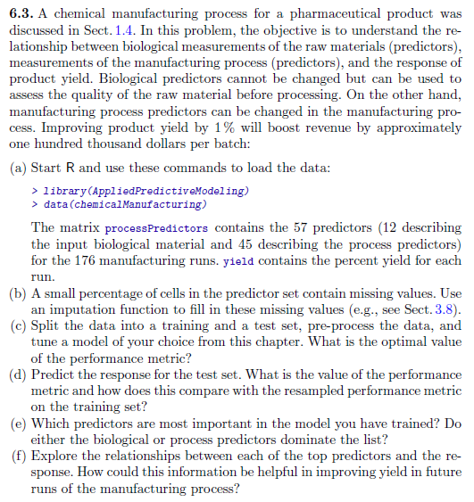
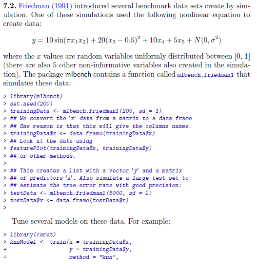
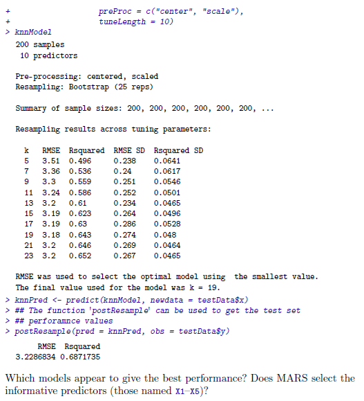
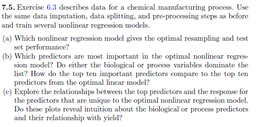
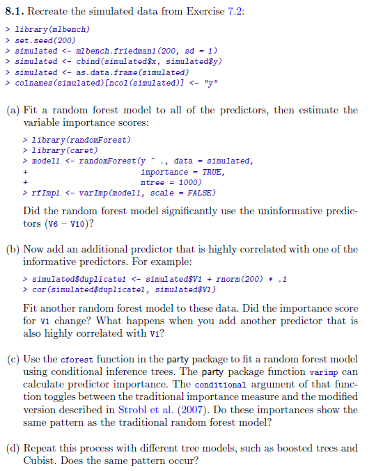
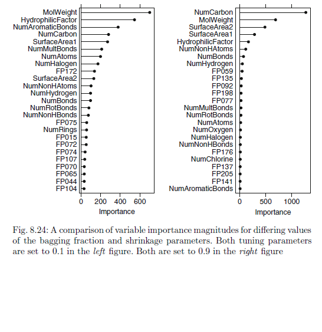
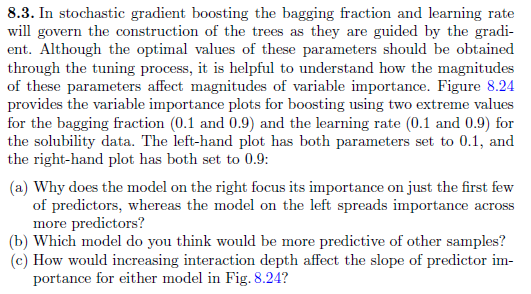
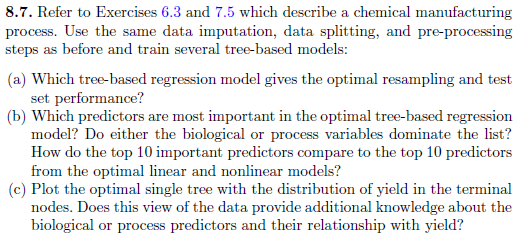

```{r setup, include=FALSE}
knitr::opts_chunk$set(echo = TRUE)
```

```{r}
library(dplyr)
library(ggplot2)
library(pander)
library(tibble)
library(purrr)
library(tidyr)
library(stringr)
library(readr)
library(forcats)
library(earth)
library(Formula)
library(plotmo)
library(plotrix)
library(TeachingDemos)
```

##### <span style="color:blue"><b><u>KJ# 6.3</u></b></span>

```{r}
```

##### <span style="color:blue"><b><u>KJ# 7.2</u></b></span>



```{r}
library(mlbench)
set.seed(200)

# training data set
trainingData   = mlbench.friedman1(200, sd = 1)
trainingData$x = data.frame(trainingData$x)

# test data set
testData       = mlbench.friedman1(5000, sd = 1)
testData$x     = data.frame(testData$x)
```

We are going to investigate the relationship between the predictors `X1`-`X10` and the response `y` in the training data:

```{r}
head(trainingData$x, 5)
head(trainingData$y, 5)

head(testData$x, 5)
head(testData$y, 5)

trainingData_df1 = mutate(trainingData$x, y=trainingData$y)
trainingData_df2 = gather(trainingData_df1, var, x, X1:X10)
trainingData_df2 = mutate(trainingData_df2, var = forcats::fct_relevel(factor(var), "X10", after = Inf))

head(trainingData_df1)
head(trainingData_df2)

trainingData_df2 <- trainingData_df2[c("var", "x", "y")]
head(trainingData_df2)
tail(trainingData_df2)
ggplot(trainingData_df2, aes(x, y)) + geom_point(color='red', alpha = 0.25) + 
  stat_smooth(method = "glm", se = FALSE) + facet_wrap(~ var, nrow = 2) 
```

From the plot, we notice that the variables $X1$, $X2$, $X4$, & $X5$ show positive correlations with the response $y$.  The remaining variables appear to show near-zero correlation to the response.

## Models
We are going to test this with three models: <br>
1) K nearest neighbors model <br>
2) MARS model  <br>
3) SVM model <br>

### K Nearest Neighbors Model
The K nearest neighbors model is used as the first model, with predictors centered and scaled:
```{r}
library(caret)
set.seed(100)
fried_knn = train(trainingData$x, trainingData$y, method = "knn", preProc = c("center", "scale"), tuneLength = 10)
```

The resampled RMSE of the model with various tuning parameters is shown below:
```{r}
ggplot(fried_knn, aes(x=k, y=RMSE)) + geom_line(color="green") + 
  geom_point(size = 1) + labs(title = "KNN model parameter vs. RMSE")
```

The optimal RMSE of this model occurs at $k$ = $9$, which yields an RMSE of `r round(min(fried_knn$results), 3)`.

### MARS Model
MARS model is used as the second model. It is used with the same pre-processing as the KNN model above, for first- and second-degree products and pruning parameter from 1-20:
```{r}
set.seed(100)
fried_mars = train(trainingData$x, trainingData$y, method = "earth", preProcess = c("center", "scale"), tuneGrid = expand.grid(degree = 1:2, nprune = 1:20))
```

The tuning profile of this model is shown below:
```{r}
ggplot(fried_mars$results, aes(x = nprune, y = RMSE, col = factor(degree))) + geom_line() + 
  geom_point(size = 1) + labs(title = "MARS model parameters vs. RMSE") + theme(legend.position = "top")
```

The optimal RMSE of `r round(min(fried_mars$results$RMSE), 3)` is obtained with a second-degree model with 16 parameters. The importance of the predictors is shown below:

`r pander::pander(varImp(fried_mars)[["importance"]])`

We notice that the five informative predictors $X1$-$X5$ are the only predictors selected by the model.

### SVM Model
SVM Model is used as the third model. 
```{r}
set.seed(100)
fried_svm = train(trainingData$x, trainingData$y, method = "svmRadial", preProc = c("center", "scale"), tuneLength = 10)
```

The tuning profile of the model is shown below:
```{r}
ggplot(fried_svm$results, aes(x = C, y = RMSE)) + geom_line(color="blue") + 
  geom_point(size = 1) + scale_x_continuous(trans = "log2") + labs(title = "Radial SVM model parameter vs. RMSE") 
```

The optimal RMSE of `r round(min(fried_svm$results$RMSE), 3)` achieved with a cost parameter $C$ = $4$ and a shape parameter $\sigma \approx `r round(fried_svm$results$sigma[[1]], 4)`$.  The RMSE of the model levels out above $C$ = $4$.

## Model Performance
Each of the models is used to predict for the test set, and their performance is measured:

```{r}
fried_knn_prediction  = predict(fried_knn, testData$x)
fried_mars_prediction = predict(fried_mars, testData$x)
fried_svm_prediction  = predict(fried_svm, testData$x)

fried_knn_performance  = defaultSummary(data.frame(obs = testData$y, pred = fried_knn_prediction))
fried_mars_performance = defaultSummary(data.frame(obs = testData$y, pred = fried_mars_prediction[, 1]))
fried_svm_performance  = defaultSummary(data.frame(obs = testData$y, pred = fried_svm_prediction))

pander(data.frame(RMSE = c(fried_knn_performance["RMSE"], 
                           fried_mars_performance["RMSE"], 
                           fried_svm_performance["RMSE"]),
       row.names = c("KNN", "MARS", "SVM")))
```

We notice that the most accurate model is the **MARS model** based on the resampled RMSE and performance against the test set.


##### <span style="color:blue"><b><u>KJ# 7.5</u></b></span>

```{r}
```

##### <span style="color:blue"><b><u>KJ# 8.1</u></b></span>


```{r}
```

##### <span style="color:blue"><b><u>KJ# 8.2</u></b></span>

```{r}
```

##### <span style="color:blue"><b><u>KJ# 8.3</u></b></span>

```{r}
```

##### <span style="color:blue"><b><u>KJ# 8.7</u></b></span>

```{r}
```